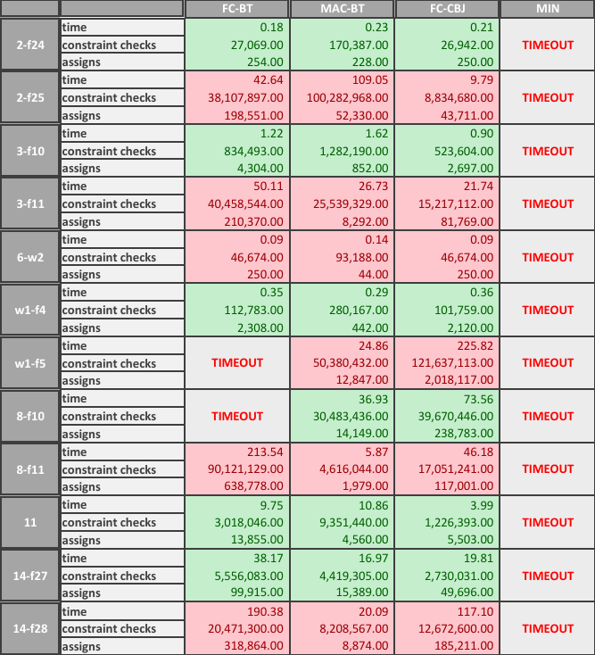

# Radio Link Frequency Assignment Problem

The **Radio Link Frequency Assignment Problem (RLFAP)** is a **Constraint Satisfaction Problem (CSP)** that involves assigning frequencies to radio links such that interference is minimized and all constraints are satisfied.
In this repository, several **backtracking-based algorithms** are implemented and compared on multiple benchmark instances from the [RLFAP dataset](https://miat.inrae.fr/schiex/rlfap.shtml).

---

## How to run
To run an individual instance with a specific algorithm 
```
python rlfap.py <instance> <algorithm>
```
To run all instances with all algorithms
```
python rlfap.py all
```

---

## Instances
The following benchmark instances are included:

| Instances | | | | | |
| -------- | -------- | -------- | -------- | -------- | -------- |
| 2-f24 | 2-f25 | 3-f10 | 3-f11 | 6-w2 | 7-w1-f4 |
| 7-w1-f5 | 8-f10 | 8-f11 | 11 | 14-f27 | 14-f28 |

Each instance represents a different RLFAP configuration with varying numbers of variables and constraints.


## Implemented Algorithms

| Algorithm | Description |
|------------|-------------|
| **FC-BT** | Forward Checking with Backtracking |
| **MAC-BT** | Maintaining Arc Consistency with Backtracking |
| **FC-CBJ** | Forward Checking with Conflict-Directed Backjumping |
| **MIN** | Minimum Remaining Values heuristic |

---

## Experimental Results

The figure below shows the runtime performance, number of constraint checks and assigns for all algorithms across all instances.



### Table results explanation
- 🟩 green cells: the program finished with a result
- 🟥 red cells: the program finished with no result
- ⏰ TIMEOUT: the program did not finish within 500 seconds


